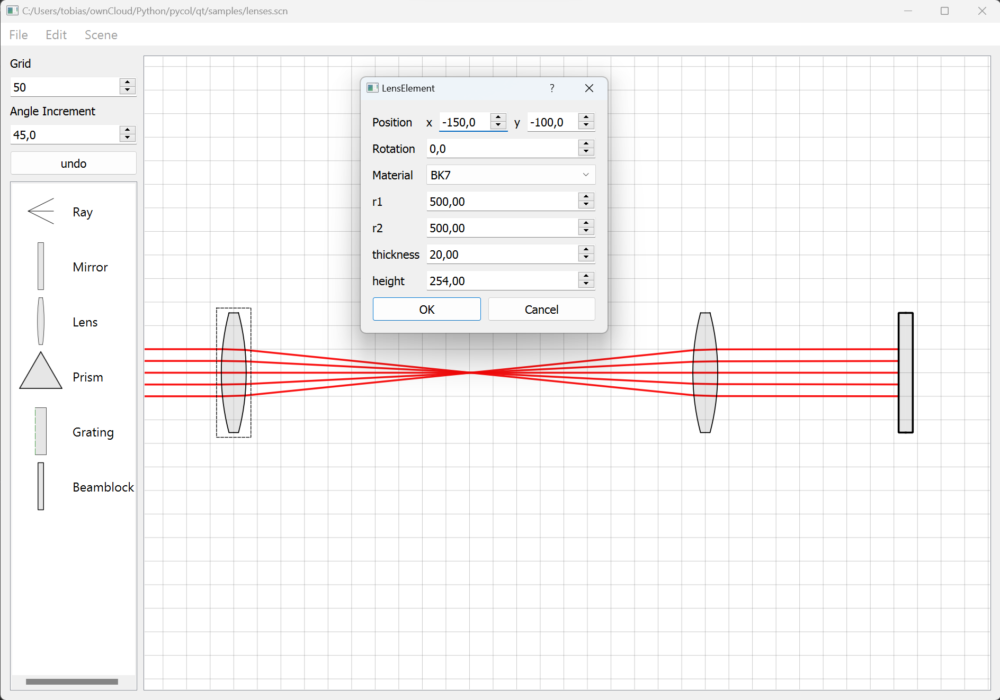
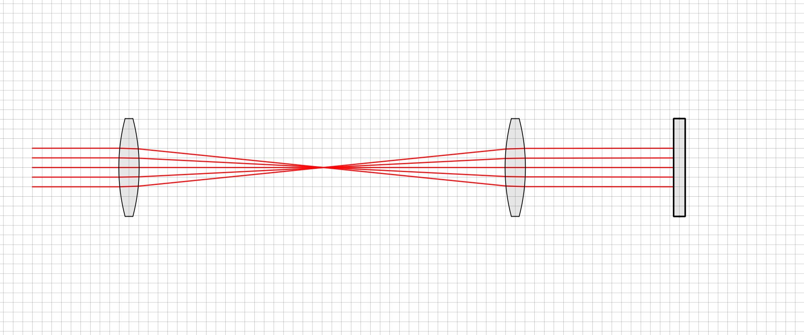
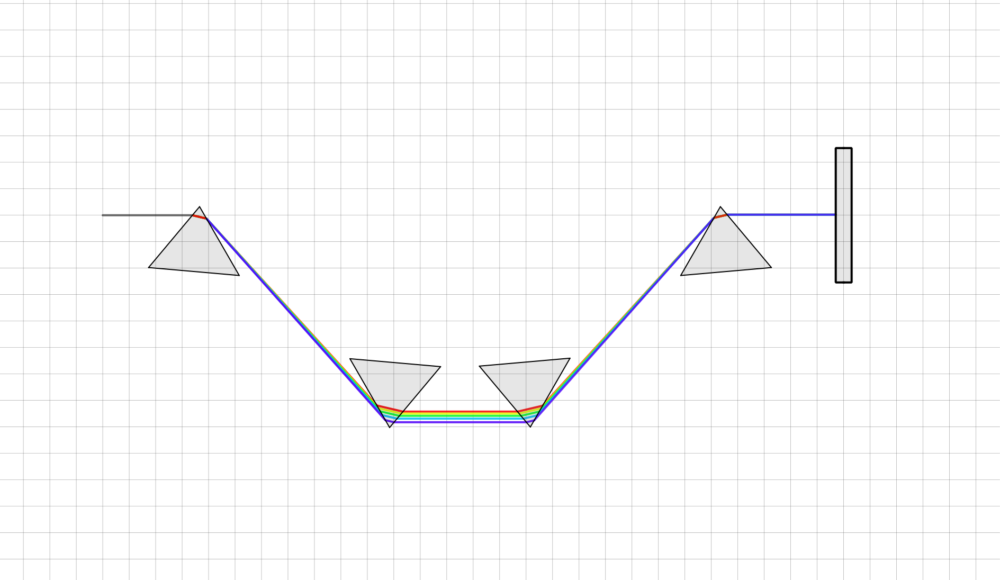
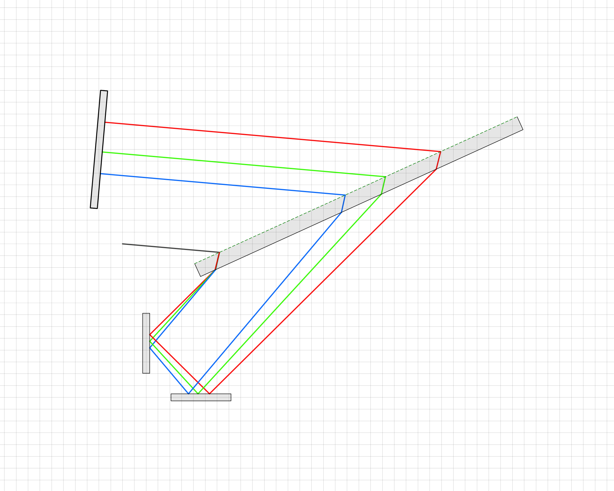

# OpticalTracer
Work in progress for a simple optical raytracer supporting mirrors, lenses, prisms and gratings

Requires PyQt5
## Screenshot

## Examples
### Lens Imaging:

### Prism Compressor:

### Grating Assembly:

